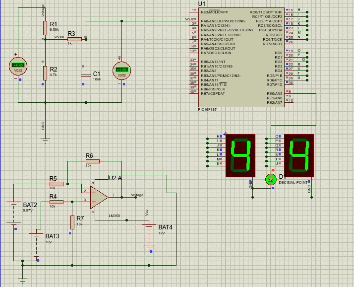

# PIC16F887 Voltmeter Project

This project implements a simple voltmeter using the **PIC16F887**
microcontroller.\
It reads an analog voltage through the ADC module, processes the value,
and displays the result on two 7-segment displays (units and decimal).

## Features

-   Internal oscillator running at **8 MHz**
-   ADC with **0--5 V** reference
-   Voltage calculation using a fixed resolution constant
-   Output shown on two 7-segment displays
-   Measures voltage using a scaling factor defined in the project

## How It Works

The ADC reads the input voltage and converts it into a digital value
(0--1023).\
The voltage is calculated using:

    Vout = VOLTAGE_RELATIONSHIP_1 × (RESOLUTION × result_conversion)

Where:\
- RESOLUTION = 0.0048875855 V/bit\
- VOLTAGE_RELATIONSHIP_1 = 2.4

## Simulation Image

Use the following line to include the simulation image:

    
